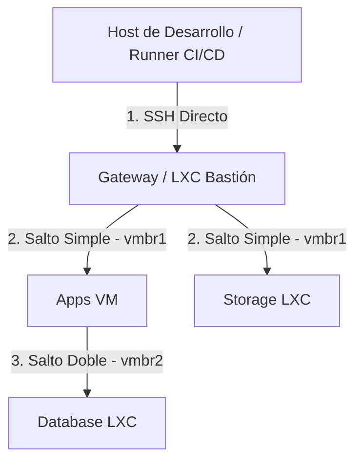

# Guía de Aprovisionamiento y Configuración de Software con Ansible

Este repositorio contiene la configuración automatizada de software y la orquestación interna de los servidores de infraestructura creados en Proxmox VE. 

---

## 1. Introducción a Ansible

**Ansible** es un motor de automatización de TI de código abierto que gestiona configuraciones, despliega aplicaciones y orquesta tareas en servidores remotos.

### Pilares del Funcionamiento de Ansible:
* **Agentless (Sin Agentes)**: No requiere la instalación de agentes o daemons en los servidores destino. Utiliza conexiones SSH estándar, ejecuta módulos cargados de forma temporal y se desconecta de forma limpia.
* **Idempotencia**: Garantiza que las tareas definan el estado final deseado. Si un paquete o configuración ya coincide con este estado, Ansible no realizará ninguna acción (retornando `OK` en lugar de `CHANGED`), lo que permite ejecutar los playbooks de forma recurrente y segura.
* **Definición Declarativa en YAML**: Las tareas y configuraciones se describen mediante una sintaxis YAML legible y estructurada en archivos llamados **Playbooks**.

---

## 2. Arquitectura de Red y Enrutamiento (ProxyJump)

En un entorno corporativo aislado, las máquinas virtuales y contenedores LXC se despliegan en subredes privadas dedicadas y separadas del tráfico de la red LAN local (por ejemplo, a través de interfaces bridge como `vmbr1` y `vmbr2`). 

Al no ser accesibles directamente desde el host de desarrollo o desde el Runner de CI/CD, Ansible implementa un esquema de **túneles SSH (ProxyJump)** a través de un nodo bastión expuesto:



### Grupos de Enrutamiento en el Inventario:
1. **Gateway (Bastión)**: Nodo frontera con doble interfaz de red (pública en la LAN local y privada en la subred de aplicaciones). Es el único punto accesible directamente.
2. **Salto Simple (Single Jump)**: Servidores en la subred de aplicaciones privada que se configuran a través del túnel SSH del Gateway:
   ```ini
   ansible_ssh_common_args='-o ProxyJump=root@<IP_PUBLIC_GATEWAY>'
   ```
3. **Salto Doble (Double Jump)**: Servidores de bases de datos aislados en la subred privada de datos que no disponen de conexión directa al Gateway. Para alcanzarlos, Ansible encadena un doble salto a través del Gateway y de la VM de aplicaciones (que actúa como puente intermedio al tener patas en ambas subredes):
   ```ini
   ansible_ssh_common_args='-o ProxyJump=root@<IP_PUBLIC_GATEWAY>,usuario@<IP_PRIVATE_APPS>'
   ```

---

## 3. Estructura del Repositorio

* **`hosts`**: Inventario de servidores clasificados por rol (`gateway`, `apps`, `database`, `storage`) y con sus respectivas políticas de ProxyJump declaradas en variables de grupo.
* **`playbook.yml`**: Playbook principal que define la secuencia de provisionamiento de software:
  * **Gateway**: Servidor web y proxy reverso **Caddy**.
  * **Apps**: Motor de contenedores **Docker Engine** e inicialización del clúster de orquestación **Docker Swarm**.
  * **Database**: Motor de base de datos **PostgreSQL 16** y caché **Redis**.
  * **Storage**: Almacenamiento S3 local compatible con **MinIO**.

---

## 4. Instrucciones de Uso y Despliegue

### Prerrequisitos:
1. Asegurar que las llaves SSH públicas de la máquina de desarrollo (o la llave de despliegue del Runner) estén autorizadas en los archivos `authorized_keys` de los servidores destino.
2. Verificar la conectividad SSH y el correcto funcionamiento del enrutamiento ProxyJump a través del comando ping de Ansible:
   ```bash
   ansible all -m ping -i hosts
   ```

### Ejecutar el Playbook:
Para desplegar e instalar todo el stack de software en los servidores:
```bash
ansible-playbook -i hosts playbook.yml
```

### Personalización de Variables:
Si requieres usar una clave SSH específica o un usuario diferente para las conexiones remotas, puedes pasar los parámetros en la ejecución:
```bash
ansible-playbook -i hosts playbook.yml --private-key=~/.ssh/id_ed25519_deploy
```
